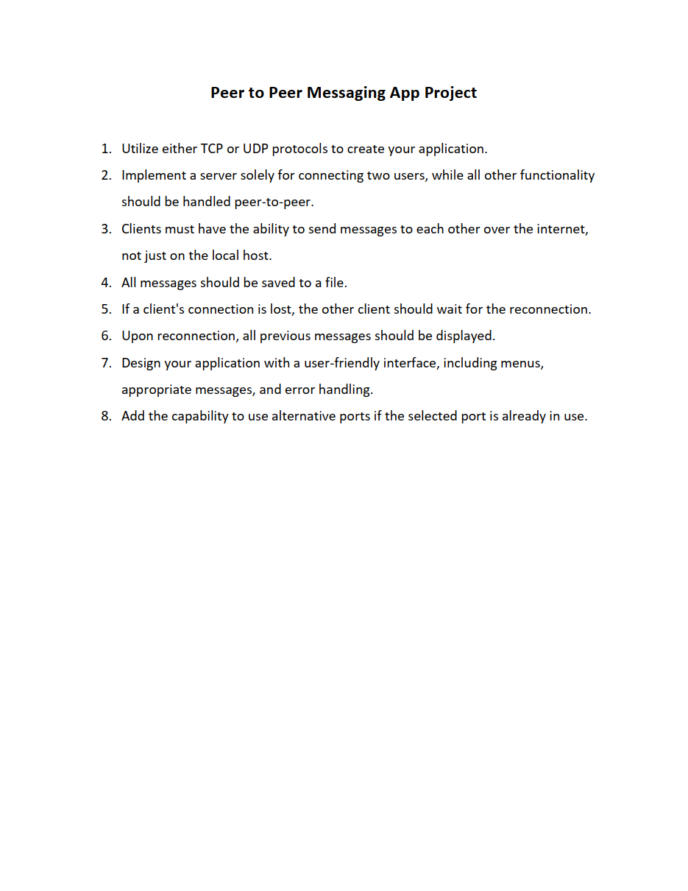

# **✉️ Peer to Peer Messaging App Project | پروژه برنامه پیام‌رسان همتا به همتا**

**A university project in which a peer-to-peer messaging application is designed in Python.**

**یک پروژه دانشگاهی که در آن یک برنامه پیام‌رسان همتا به همتا به زبان پایتون طراحی می‌شود.**

# 💬 **نکات پروژه**

* عکس‌های برنامه در دایرکتوری ScreenShots قرار دارند.
* برای اجرا برنامه، به پایتون بالاتر از نسخه 3.6 نیاز دارید.
* بهتر است سرور روی یک سیتم عامل لینوکسی اجرا شود.
* دو تا کلاینت نباید آیپی‌های یکسان داشته باشند.
* کتابخانه‌های مورد نیاز در فایل requirements.txt قرار دارند.
* برای دسترسی به همه‌ی پروژه‌های دانشگاهی من، به این لینک مراجعه کنید:

👈🏻 **[پروژه‌های دانشگاهی من](https://github.com/bestmahdi2/Uni__Bachelors_SKU_Path)**

# 📝 **توضیحات پروژه**

# 🖼 **عکس‌های پروژه**

  
  
  
  
  

